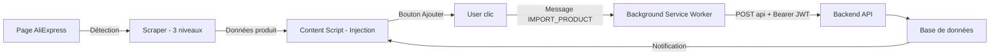

# 🚀 SC GO — Product Importer

**Extension Chrome (Manifest V3)** pour importer des produits AliExpress en 1 clic vers votre boutique.

## ✨ Fonctionnalités

- ✅ Détection automatique des pages produit AliExpress
- ✅ Extraction en 3 niveaux (JSON caché → Script → Scraping DOM)
- ✅ Bouton d'ajout flottant violet sur AliExpress
- ✅ Import direct vers API backend (Bearer JWT)
- ✅ Popup de preview avec variantes et prix calculés
- ✅ Badge avec nombre de produits détectés
- ✅ Page d'options (URL backend, token, marge par défaut)
- ✅ Build Vite + TypeScript
- ✅ Packaging automatique ZIP
- ✅ Notifications de succès/erreur

## 📦 Installation

### Prérequis
- Node.js 18+
- npm

### Installation

```bash
cd sc-go
npm install
npm run build
```

### Chargement dans Chrome

1. Ouvrir Chrome → `chrome://extensions`
2. Activer le mode développeur
3. Cliquer sur **Charger l'extension non empaquetée**
4. Sélectionner le dossier `sc-go/dist`
5. Épingler l'extension pour accès rapide

## 📂 Structure du projet

```
sc-go/
├── manifest.json            # Manifest V3
├── package.json             # Dépendances npm
├── tsconfig.json            # TypeScript
├── vite.config.ts           # Build Vite
├── scripts/
│   └── pack.mjs             # Packaging ZIP
├── public/
│   └── icons/               # Icônes de l'extension
├── src/
│   ├── shared/
│   │   └── types.ts         # Types TypeScript partagés
│   ├── background/
│   │   └── bg.ts            # Service Worker
│   ├── content/
│   │   ├── scraper.ts       # Extraction AliExpress (3 niveaux)
│   │   ├── content.ts       # Injection bouton + logique import
│   │   └── content.css      # Styles bouton
│   ├── popup/
│   │   ├── popup.html       # UI popup
│   │   ├── popup.ts         # Logique popup
│   │   └── popup.css        # Styles popup
│   └── options/
│       ├── options.html     # Page configuration
│       ├── options.ts       # Logique options
│       └── options.css      # Styles options
└── dist/                    # Build output
```

## 🔄 Flux de travail



## ⚙️ Configuration

Modifier `src/options/options.html` :

- URL API backend : `https://votreboutique.com/api/admin/aliexpress/import-extension`
- Token JWT : Coller votre token JWT (celui utilisé pour l'import)
- Marge par défaut : Pourcentage à appliquer sur le prix AliExpress

### Exemple de configuration
```javascript
// Dans src/options/options.ts
const backendUrlInput = document.getElementById('backendUrl') as HTMLInputElement;
const tokenInput = document.getElementById('token') as HTMLInputElement;
const marginInput = document.getElementById('margin') as HTMLInputElement;

backendUrlInput.value = 'https://votreboutique.com/api/admin/aliexpress/import-extension';
tokenInput.value = 'eyJhbGciOiJIUzI1NiIsInR5cCI6IkpXVCJ9...'; // Votre token JWT
marginInput.value = '65'; // Marge de 65%
```

## 🎨 Design

### Bouton flottant (sur AliExpress)

Violet, fixe en bas à droite, badge avec nombre de produits détectés :


### Popup de preview

```
┌─────────────────────────────┐
│ Product Importer        [x] │
├─────────────────────────────┤
│                             │
│  ┌───────────────────────┐  │
│  │  Image produit        │  │
│  └───────────────────────┘  │
│                             │
│  Product Title              │
│                             │
│  Price: $10.00 → $16.67   │
│                             │
│  Variations:              │
│  • Size S - Black: +$0.00   │
│  • Size M - Red:   +$1.00   │
│                             │
│  [ Import Product ]         │
│                             │
└─────────────────────────────┘
```

## 🛠️ Build & Packaging

```bash
# Build
npm run build

# Package ZIP
npm run package
```

Le fichier ZIP sera créé dans `sc-go/dist/sc-go-v1.0.0.zip`.

## 🧪 Tests

```bash
# Vérifier les erreurs de build
npm run build

# Vérifier TypeScript
npm run type-check
```

## 📝 Licences & Remerciements

- MIT License
- Built with Vite
- Uses native Chrome Extension APIs (Manifest V3)

